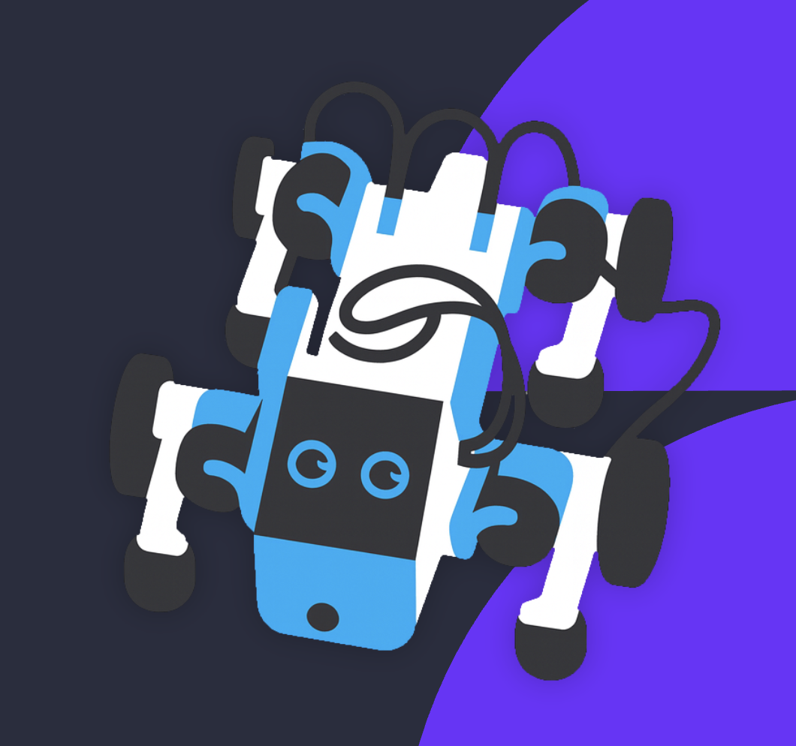

# Pupper Car - Final Project Fall 2025

A hybrid locomotion robot that seamlessly transitions between legged walking and wheeled driving modes using neural network control.



## 📹 Project Media

- **[Presentation Slides](https://docs.google.com/presentation/d/1IoalwCc1xfUpIS3WWAN9aYuX4UvmnPgCYcaCrfWN30Q/edit?usp=drive_link)**
- **[Demo Video](https://drive.google.com/file/d/1J51jvY-WKSuhcJ0y78MMbJDYbzFxi9ft/view?usp=sharing)**

## 🎯 Overview

This project implements a versatile locomotion system for the Pupper v3 robot, enabling it to operate as both a quadruped walker and a wheeled vehicle. The system uses a neural network controller for smooth transitions between gaits and responsive real-time control.

### Key Features

- **Dual Locomotion Modes**: Switch between walking and wheeled driving
- **Neural Network Control**: Trained policy for natural movement
- **Real-time Mode Switching**: Seamless transitions via controller input
- **Teleoperation**: Intuitive joystick control for navigation

## 🚀 Quick Start

### Prerequisites

- Pupper v3 robot with ROS2 workspace installed
- Python 3.x
- ROS2 (Humble or later)
- Weights & Biases account (for policy tracking)

### Installation

1. Clone this repository:
```bash
cd /home/pi/
git clone https://github.com/jzhang29-max/final_project_2025
cd final_project_2025
```

2. Deploy configuration files and build the workspace:
```bash
python3 rebuild_neural_controller.py
```

This will:
- Copy configuration files to the ROS2 workspace
- Build the neural controller package
- Set up Weights & Biases for experiment tracking

## 🎮 Running the Robot

### Step 1: Launch the Neural Controller

Start the ROS2 neural controller node:

```bash
ros2 launch neural_controller launch.py
```

Wait for the controller to initialize completely.

### Step 2: Start the Control Interface

In a new terminal, run the control script:

```bash
python3 wc.py
```

### Step 3: Control the Robot

Use your game controller to operate the robot:

- **X Button**: Activate **walking gait** mode (quadruped locomotion)
- **Square Button**: Activate **wheel mode** (wheeled driving)
- **Left Joystick**: Control **turning** (left/right)
- **Right Joystick**: Control **forward/backward movement**

## 📁 Project Structure

```
pupper-car-project/
├── config.yaml                   # Neural controller configuration
├── launch.py                     # ROS2 launch file
├── estop_controller.cpp          # Emergency stop controller
├── parkour_policy.json           # Parkour mode neural network policy
├── wc.py                         # Control wheel locomotion script
├── rebuild_neural_controller.py  # Deployment and build script
├── download_latest_policy.py     # Download policies from wandb
├── deploy.py                     # Interactive launch script
└── README.md                     # This file
```

## 🔍 Troubleshooting

### Controller Not Responding
- Ensure both terminals are running (neural controller + wc.py)
- Check that your game controller is properly connected
- Verify ROS2 nodes are active: `ros2 node list`

### Build Failures
- Check ROS2 workspace path is correct
- Ensure all dependencies are installed
- Try cleaning the build: `cd ~/pupperv3-monorepo/ros2_ws && rm -rf build install log`

### Mode Switching Issues
- Wait for full initialization before switching modes
- Ensure emergency stop is not engaged
- Check controller battery level

## 📝 Technical Details

- **Framework**: ROS2 (Robot Operating System 2)
- **Neural Network**: Custom trained policy for locomotion
- **Control Frequency**: Real-time responsive control loop
- **Supported Hardware**: Pupper v3 quadruped robot platform

## 👥 Team

*Cole McBeth, Jiaming Zhang, Ben Wengreen*

## 📄 License

This project is part of the Pupper open-source initiative. Please keep repositories public to contribute to the community.

## 🙏 Acknowledgments

- Stanford Pupper Team
- Course Staff and Instructors
- Open-source ROS2 community

---

*For more information about the Pupper project, visit [Pupper Documentation](https://cs123-stanford.readthedocs.io/en/latest/)*
